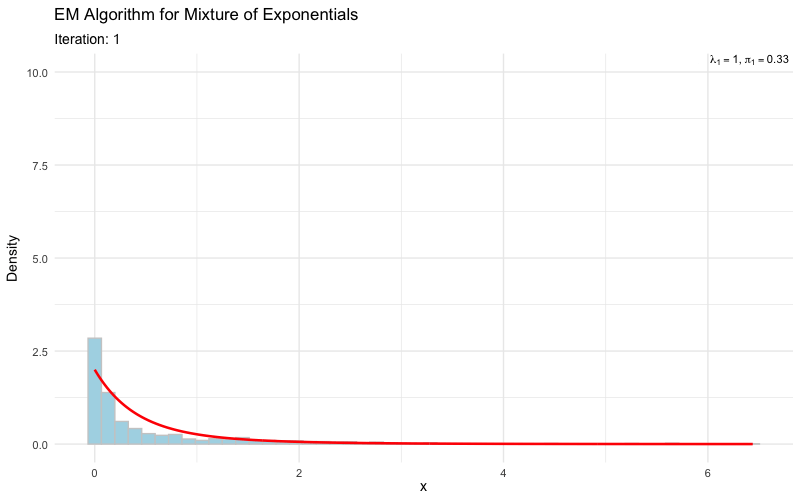

## understanding-mcmc

This repo contains R scripts along with the derivations for understanding key concepts in Markov Chain Monte Carlo (MCMC) methods. The goal, as a student is to become familiar with the fundamental principles and applications of MCMC techniques in statistical modeling and inference. Andreiu et. al. provides a primer which will be the basis for the scripts and derivations here.

- [MCMC Primer](https://www.cs.ubc.ca/~arnaud/andrieu_defreitas_doucet_jordan_intromontecarlomachinelearning.pdf)

